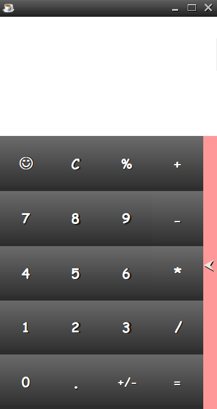
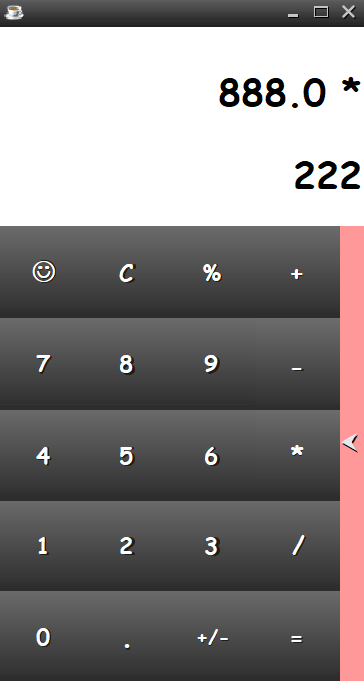
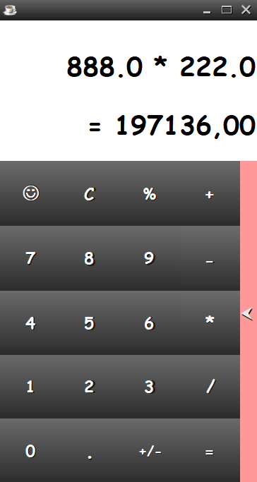

# Description de Projet: Calculatrice

> L'objectif est de réaliser une calculatrice très simple pouvant calculer une somme, une soustraction, une multiplication, une division et
le reste d’une division entière de deux opérandes, ainsi que le changement de signe d'un opérande.

##  Outils et environnement de développement 

       <b> JAVA ( JDK + JRE ) </b>
    -- <b> IDE ( Eclipse ) </b>

## Spécifications 
- Données : 2 opérandes et un opérateur
- Résultat : résultat de l’opération choisie
- Attention à la division par zéro qui est impossible
- Les opérateurs 
  - `+` : Addition
  - `-` : Soustraction
  - `*` : Multiplication
  - `/` : Division 
  - `+/-` : Changement de signe 
  - `%` : Le reste de division entière
  - `C` : Effacement de tous
  - `🙂` : Effacement du dernier nombre inscrit
##### Interfaces 
<table align="center">
  <tr>
    <td>   </td> <td>  </td> <td>   </td>
  </tr>
 </table>

 
<table align="center">
  <tr>
    <th>
    📝 Codez votre propre calculatrice ou développez celle-ci pour avoir mieux que ça.
    </th>
  </tr>
